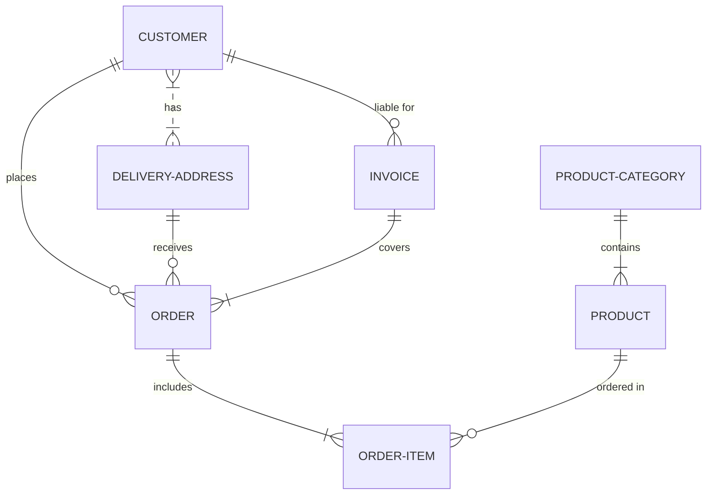

DynamoDB is a NoSQL database.  The design of the schema is based on the access patterns that are required.   For the material price and availability data, the important access patterns are:

| Access Pattern |
|:---:|
| Look up latest price and inventory for all products by store |
| Get latest price and inventory for a given product at all stores |
| Get latest price and inventory for a given product at all stores with specified zip code |
| Find stores with the lowest price for a given product |
| Find stores with the lowest price for a given product at all stores with specified zip code |
| Get price history of a given product within a given date range |
| Get price history of a given product at a retailer within a given date range |



Example AWS CLI command to create DynamoDB table from JSON file.

```
aws dynamodb create-table --cli-input-json file://create-table-materials.json --region us-east-1
```
